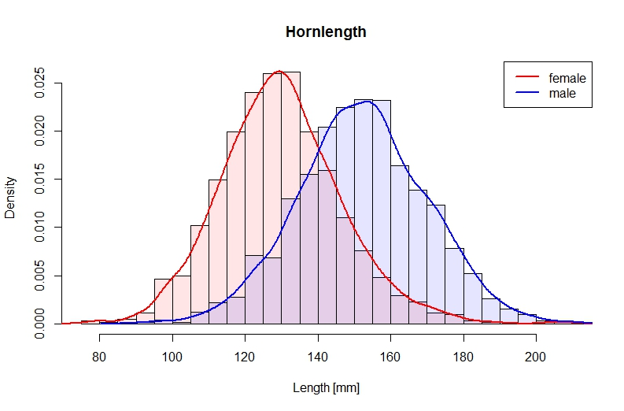
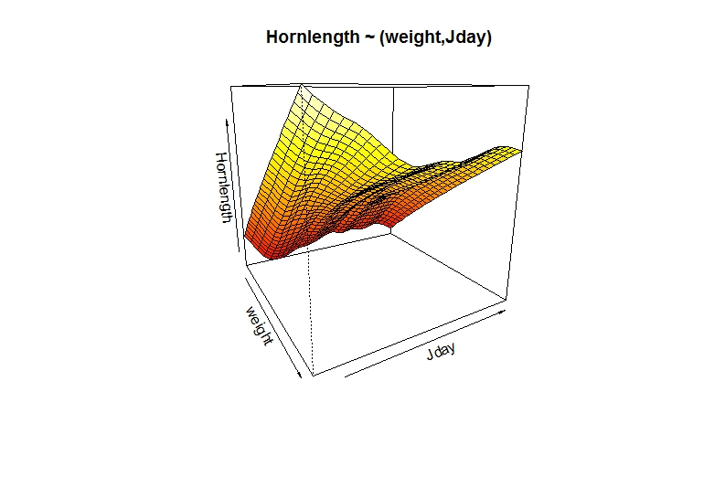

## Research Question

How are male and female chamois reacting differently on environmental conditions regarding their investment in horn growth?

## Data Exploration: Hornlength

                                                
                                                
                                                
## Data Exploration Hornlength: Outlayers?

                                               
## Data Exploration: Weight                                                

                                                
## Data Exploration: Hornlength ~ Weight                                                

                                                
## Data Exploration: Elevation
mean hornlength at lowest "area": 158.0 mm

mean hornlength at higest "area"" : 137.3 mm

## Data Exploration: Weight ~ Elevation

mean hornlength at higest "area"" : 137.3 mm
                                                
## Data Exploration: Weight ~ Day of the Hunting Season
                                               
                                                
## Data Exploration: Horn ~ Day of the Hunting Season I
  
                                                
## Data Exploration: Horn ~ Day of the Hunting Season II
 

## Data Exploration: Horn ~ Day of the Hunting Season III

