```{r, echo=FALSE, include=FALSE}
library(mgcv)
load("db_chamois1.RData")
```

## Research Question

We wanted to explore how male and female Chamois react differently on environmental conditions regarding their investment in horn growth.


## Dataset

- Dataset with 2679 observations of 101 variables
- Data of individuals:
    - Horn length
    - Weight
    - Sex
- Other data aggregated at either council level (50 councils)
    - GIS data like elevation, aspect
    - Vegetation Index
- Or at Area level (5 Areas)
    - Weather
    - Substrate


## Life History of killed Chamois

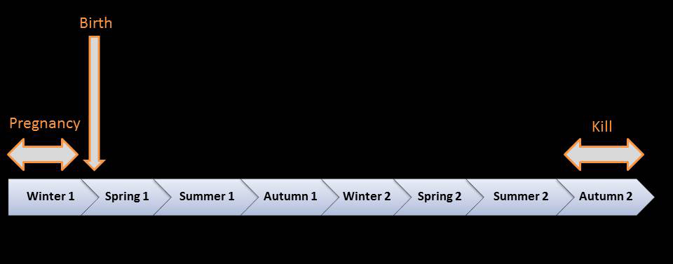

- Shot during second year
- Climate and vegetational information aggregated through seasons

## Data exploration - Spatial distribution of horn sizes

```{r, echo=FALSE}
m1 <- gam(horn~s(x.council, y.council), data=db_chamois1)
vis.gam(m1, plot.type = "contour", main="Horn size", xlab="x coords", ylab="y coords")

# distribution of councils by admin. area
points(db_chamois1$x.council, db_chamois1$y.council, col=db_chamois1$area_cod, pch=20, cex=1.5)
legend("bottomright", legend=paste("Area", unique(db_chamois1$area_cod)), col=unique(db_chamois1$area_cod), pch=20)
# no data in south-east and north-west!
```

## Data exploration - Visualization of Correlation

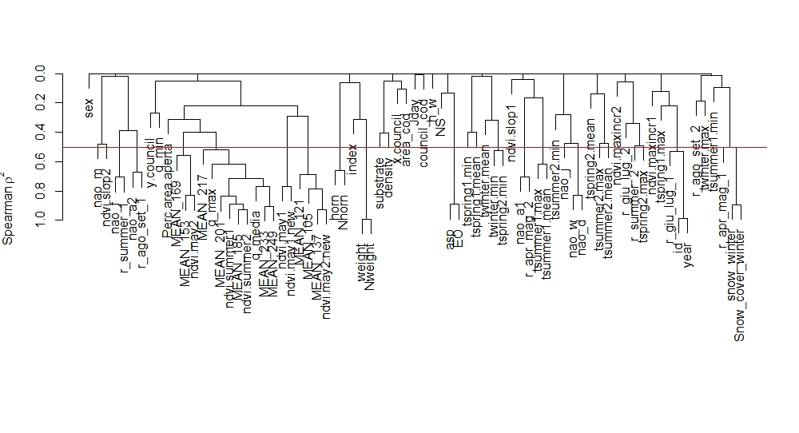

## Random Forest: Effect of predictors on horn size

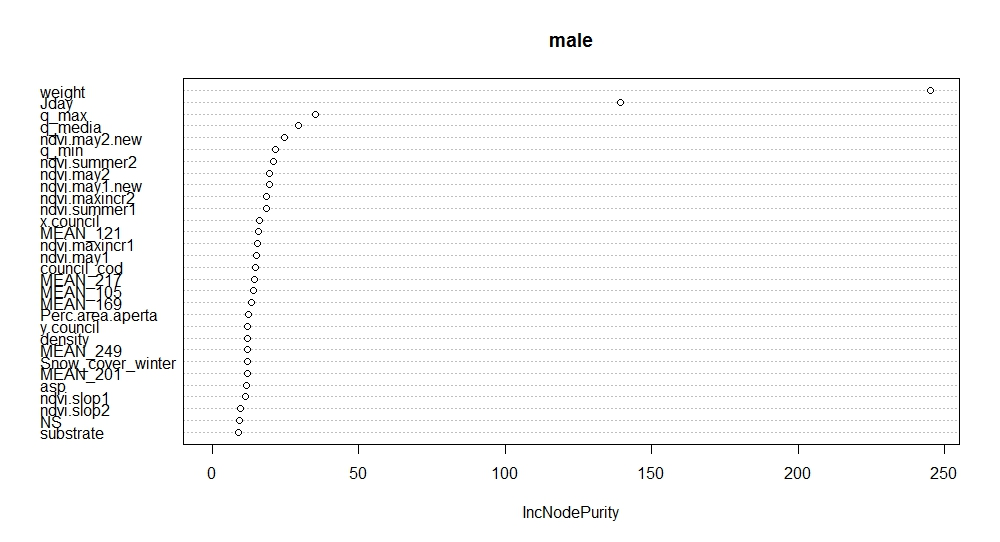

## Random Forest: Effect of predictors on horn size

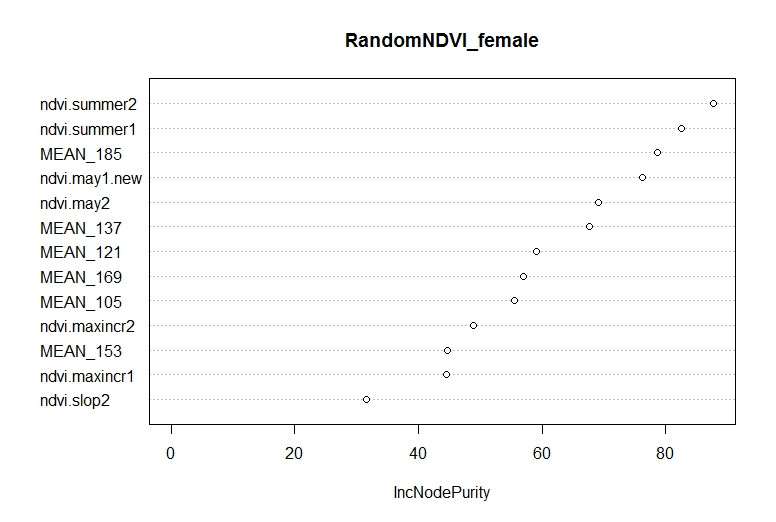


## Struggling with data

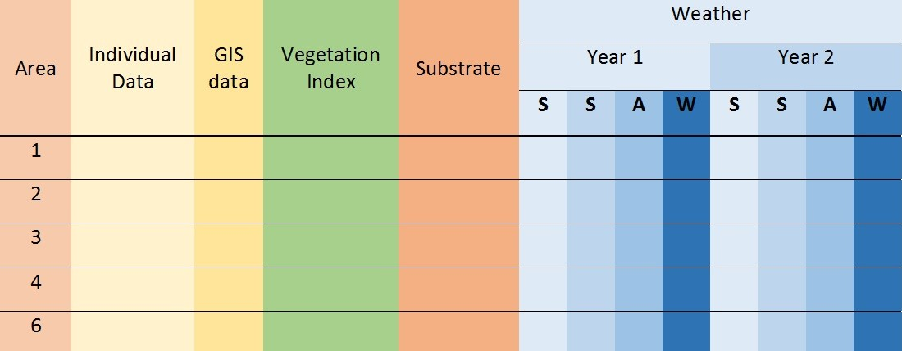

## Struggling with data

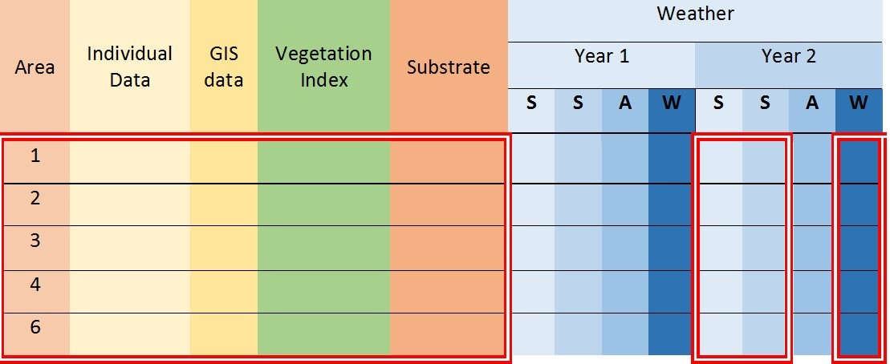

## Struggling with data

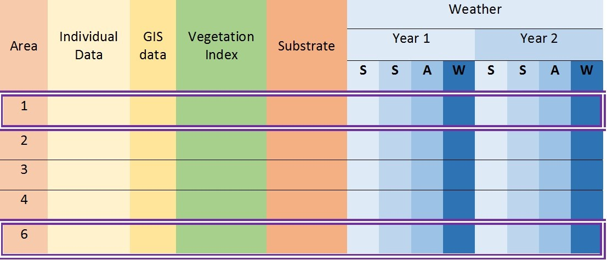

## Struggling with data

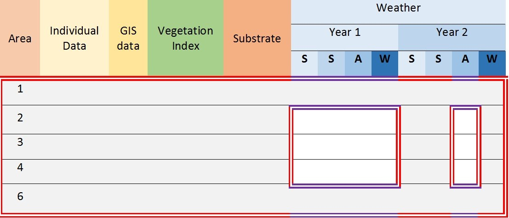

## Struggling with data

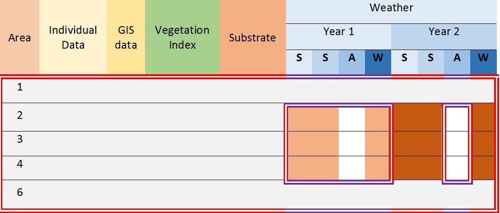

## Struggling with data

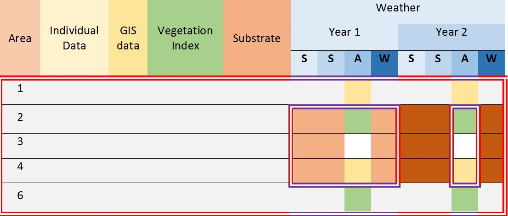

## Struggling with data

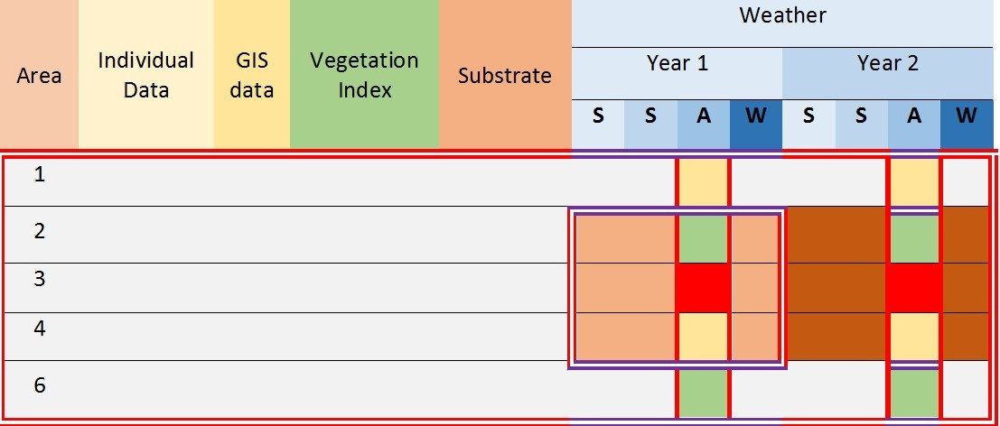

## Vielen Dank!

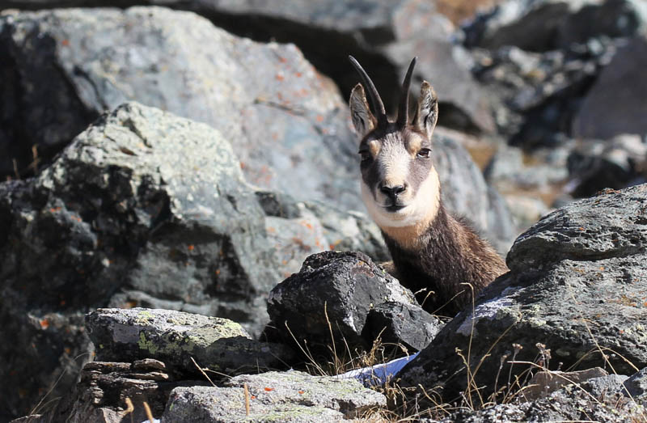

