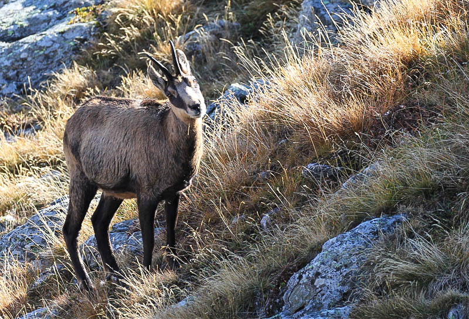
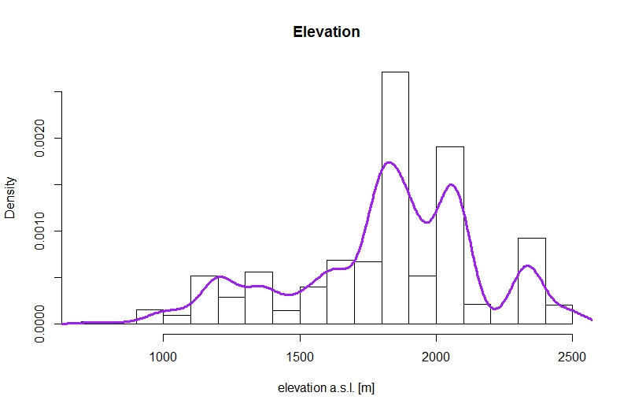
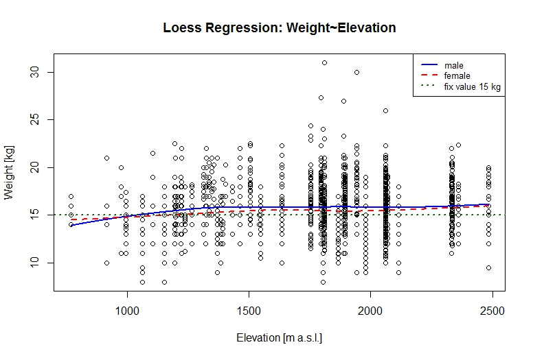
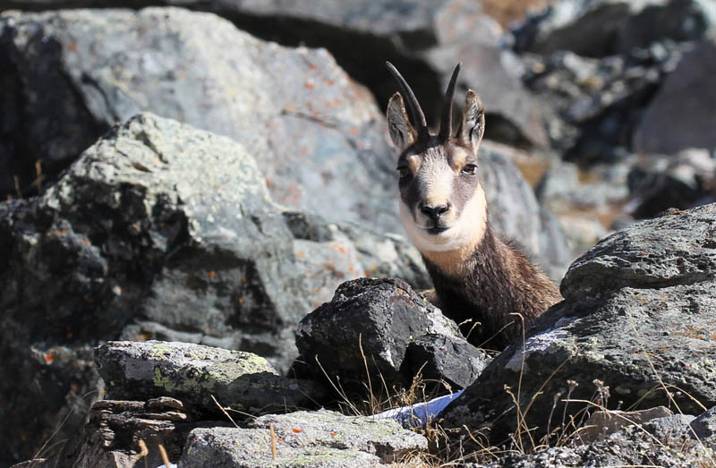

```{r echo=FALSE, include=FALSE}
library(mgcv)
load("db.RData")
attach(db)
f.sex<-as.factor(sex)# transformation of sex data to class factor
levels(f.sex) <- c("female", "male") # relevel sex

```

## No more struggle with data

- Received missing weather data and plugged them into our old dataset
- But data was inconsistent
- ???


- Decided to take data from two stations with 
    - Continuous measurements
    - Representative elevation
- Now every council has the same weather data per year for the whole life cycle of the shot chamois


- Now we have 2679 observations of 82 predictors

## Research Question

How are male and female chamois reacting differently on environmental conditions regarding their investment in horn growth?



## Data Exploration: Hornlength

```{r echo=FALSE}
hist(horn[sex==1],breaks=40,freq=FALSE,col=rgb(1,0,0,0.1), main="Hornlength", xlab= "Length [mm]")
hist(horn[sex==2],breaks=40,freq=FALSE,add=TRUE,col=rgb(0,0,1,0.1))
lines(density(horn[sex==1]), col="red", lwd=2)
lines(density(horn[sex==2]), col="blue", lwd=2)
legend("topright",lwd=c(2,2),col=c("red","blue"),legend=c("female", "male"))

```


## Data Exploration Hornlength: Outlayers?

```{r, echo=FALSE}
boxplot(horn~f.sex, data = db, main= "Hornlength ",ylab= "length [mm]", xlab= "sex")
```

## Data Exploration: Weight

```{r echo=FALSE}
hist(weight[sex==1],breaks=20,freq=FALSE,col=rgb(1,0,0,0.1), main="Weight", xlab= "Weight [kg]")
hist(weight[sex==2],breaks=20,freq=FALSE,add=TRUE,col=rgb(0,0,1,0.1))
lines(density(weight[sex==1]), col="red", lwd=2)
lines(density(weight[sex==2]), col="blue", lwd=2)
legend("topright",lwd=c(2,2),col=c("red","blue"),legend=c("female", "male"))

```

## Data Exploration: Hornlength ~ Weight

```{r echo=FALSE}
par(mar=c(1, 1, 2, 1))
m1<-gam(horn~s(weight)+f.sex+s(q_media),data=db)
vis.gam(m1,theta =40, main ="Horn~Weight+Sex", zlab="hornlength",xlab ="female          male")
```


## Data Exploration: Weight ~ Day of the Hunting Season

```{r echo=FALSE}
par(mar=c(1, 1, 2, 1))
Julgam3<-gam(weight~s(Jday)+f.sex, data=db)
vis.gam(Julgam3,plot.type="persp",theta=45, main="Weight ~ Julianday + Sex",zlab="weight", xlab="female       male",ylab="Day of Hunting Season")
```


## Data Exploration: Horn ~ Day of the Hunting Season I

```{r echo=F}

female<-subset(db,sex==1)#1218
male<-subset(db,sex==2)#1461
#The dataset represents 1218 female and 1461 male chamois


#Loess_horn_male------------------------------------------------------------
fmLoess_Jday_m <- loess(horn ~ Jday,family="gaussian",span=0.8, data=male)
newday_m <- seq(from=min(male$Jday), to=max(male$Jday),by=1)
pred_Horn_m <- predict(fmLoess_Jday_m, newday_m, se=TRUE)
plot(horn~Jday, main ="Loess Regression: Horn~Julianday",ylab="Hornlength [mm]",xlab="Day of the year",pch=1)
lines(pred_Horn_m$fit~newday_m,col="blue", lwd=2)


#Loess horn Female -------------------------------------------------------
fmLoess_Jday_f <- loess(horn~Jday,family="gaussian",span=0.8, data=female)
newday_f <- seq(from=min(female$Jday), to=max(female$Jday),by=1)
pred_Horn_f <- predict(fmLoess_Jday_f, newday_f, se=TRUE)
lines(pred_Horn_f$fit~newday_f,col="red", lwd=2)

abline(h=140,col="darkgreen",lty=2,lwd=2)
abline(h=160,col="darkgreen",lty=2,lwd=2)
legend("topright",lwd=c(2,2,2),lty=c(1,1,2),col=c("blue","red","darkgreen"),legend=c("male","female", "fix value 140 mm & 160 mm"),cex=0.8)
```


## Data Exploration: Horn ~ Day of the Hunting Season II

```{r echo=FALSE}
par(mar=c(1,1,2,1))
fgam1 <- gam(horn ~ s(weight) + s(Jday), data=db)
vis.gam(fgam1, theta=40, phi=5, main="Hornlength ~ Weight + Julian day")
```


## Data Exploration: Horn ~ Day of the Hunting Season III

```{r echo=FALSE}
par(mar=c(1,1,2,1))
fgam2 <- gam(horn ~ s(weight, Jday), data=db)
vis.gam(fgam2, theta=60, phi=15, main="Hornlength ~ s(Weight, Julian day)")
```


## Data Exploration: Elevation

- mean hornlength at lowest "area": 158.0 mm
- mean hornlength at higest "area"" : 137.3 mm



## Data Exploration: Weight ~ Elevation
  

## Data Exploration: Horn~ Elevation


## Random Effects

- We identified two random effects a priori

```{r}
head(with(db, tapply(horn, list(council_cod, year), mean)))
```

## Random Effects: Year and Council
- 50 councils with multiple measurements
- Not every council has the same number of measurements

- Also a difference in Horn length per year
- Not every year has the same number of measurements

```{r eval=FALSE}
gamm(horn ~ ..., random=(1|year) + (1|council_cod))
```


## Thank You


- 
